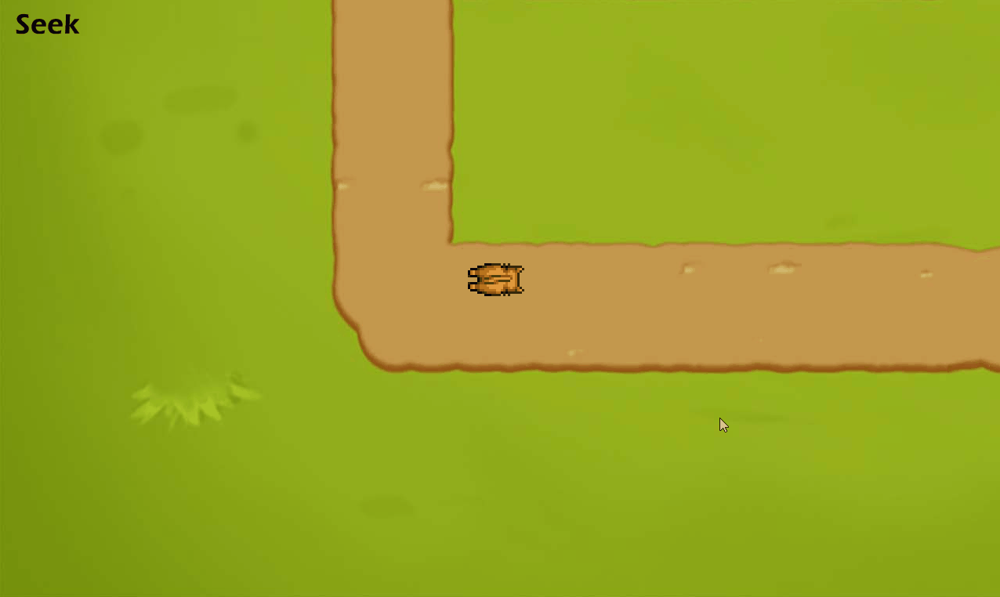

# C++ Artificial Intelligence Steering Behaviors

C++ AI Steering Behaviors algorithm's implementation following the book "Artificial Intelligence for Games by Ian Millington and John Funge".

Use the mouse to target a destination and press the following numeric keys to open the following scenes:

- 1: Seek

- 2: Flee

- 3: Arrive

- 4: Pursue

- 5: Evade

- 6: Wander

- 7: Path Following

- 8: Collision Avoidance

- 9: Combining Steering Behaviors

